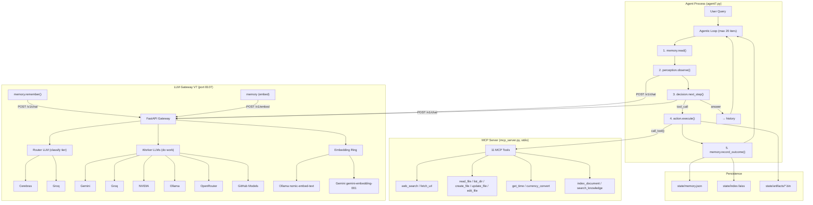
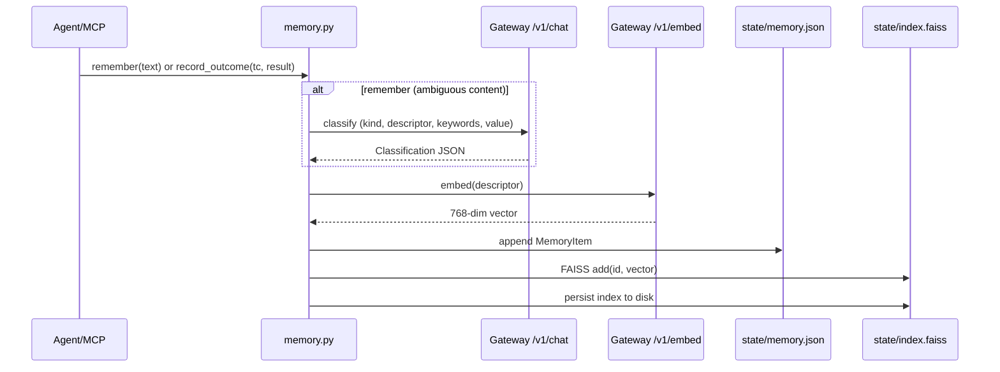
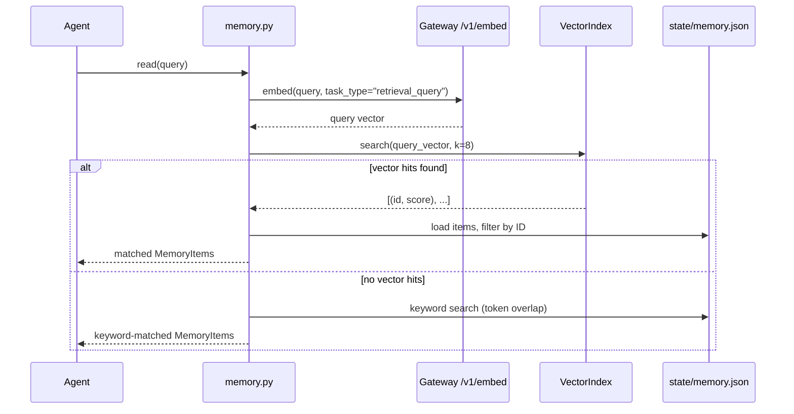
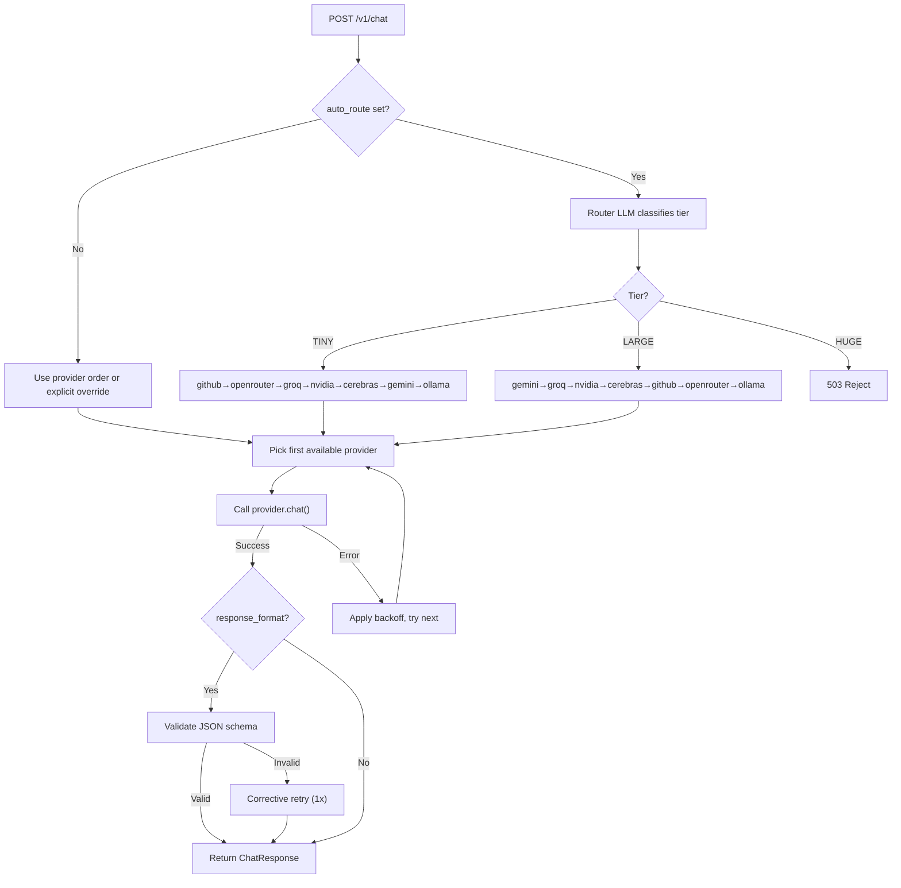

# Complete Codebase Guide for Agent system

> **Purpose**: This document gives an AI agent everything it needs to understand, navigate, modify, and debug this codebase — fast. Read top-to-bottom for a full mental model; use the table of contents to jump to specifics.

---

## Table of Contents

1. [What This Project Is](#1-what-this-project-is)
2. [Repository Layout](#2-repository-layout)
3. [Architecture Overview](#3-architecture-overview)
4. [The Agentic Loop — Step by Step](#4-the-agentic-loop--step-by-step)
5. [Module-by-Module Deep Dive](#5-module-by-module-deep-dive)
   - [agent7.py — Orchestrator](#agent7py--orchestrator)
   - [perception.py — Goal Decomposition & Tracking](#perceptionpy--goal-decomposition--tracking)
   - [decision.py — Tool or Answer Selection](#decisionpy--tool-or-answer-selection)
   - [action.py — MCP Dispatch](#actionpy--mcp-dispatch)
   - [memory.py — Typed Persistent Memory](#memorypy--typed-persistent-memory)
   - [schemas.py — Shared Contracts](#schemaspy--shared-contracts)
   - [artifacts.py — Content-Addressable Blob Store](#artifactspy--content-addressable-blob-store)
   - [vector_index.py — FAISS Wrapper](#vector_indexpy--faiss-wrapper)
   - [gateway.py — Bridge to llm_gatewayV7](#gatewaypy--bridge-to-llm_gatewayv7)
   - [mcp_server.py — 11-Tool MCP Server](#mcp_serverpy--11-tool-mcp-server)
   - [test_mcp_server.py — Tests](#test_mcp_serverpy--tests)
6. [LLM Gateway V7 — Deep Dive](#6-llm-gateway-v7--deep-dive)
   - [main.py — FastAPI Server](#mainpy--fastapi-server)
   - [providers.py — Provider Adapters](#providerspy--provider-adapters)
   - [router.py — Capability-Aware Routing](#routerpy--capability-aware-routing)
   - [embedders.py — Embedding Providers](#embedderspy--embedding-providers)
   - [schemas.py — Gateway Request/Response Models](#gateway-schemaspy)
   - [client.py — Python Client](#clientpy--python-client)
   - [cache.py — Gemini Prompt Cache](#cachepy--gemini-prompt-cache)
   - [db.py — SQLite Call Logging](#dbpy--sqlite-call-logging)
7. [Data Flow Diagrams](#7-data-flow-diagrams)
8. [Key Design Decisions & Tradeoffs](#8-key-design-decisions--tradeoffs)
9. [Environment & Configuration](#9-environment--configuration)
10. [How to Run](#10-how-to-run)
11. [Common Modification Scenarios](#11-common-modification-scenarios)
12. [Gotchas & Known Issues](#12-gotchas--known-issues)

---

## 1. What This Project Is

This is a **cognitive-architecture AI agent** (EAGV3 Session 7) that:

1. Takes a natural-language query from the user
2. Decomposes it into goals
3. Iteratively uses **LLM calls + MCP tools** to accomplish each goal
4. Maintains **persistent vector memory** (FAISS) across turns and runs
5. Routes all LLM calls through a **custom LLM Gateway** that provides free-tier access to multiple LLM providers with automatic failover

The agent follows a **Perception → Decision → Action → Memory** loop (max 20 iterations). Session 7 adds FAISS-backed vector search and document indexing on top of the Session 6 architecture.

---

## 2. Repository Layout

```
S7/                                  ← Agent root (this project)
├── agent7.py                        ← Main orchestrator — the agentic loop
├── perception.py                    ← Goal decomposition + tracking (LLM call)
├── decision.py                      ← Pick tool or answer for current goal (LLM call)
├── action.py                        ← Execute MCP tool call (no LLM)
├── memory.py                        ← Persistent typed memory with vector search
├── schemas.py                       ← Pydantic contracts shared by all layers
├── artifacts.py                     ← Content-addressable blob store (SHA256)
├── vector_index.py                  ← FAISS IndexFlatIP wrapper
├── gateway.py                       ← Bridge to llm_gatewayV7 (auto-start + client import)
├── mcp_server.py                    ← 11-tool MCP server (stdio transport)
├── test_mcp_server.py               ← Pytest tests for MCP tools
├── pyproject.toml                   ← Agent dependencies (Python ≥3.11)
├── requirements.txt                 ← Flat dep list
├── .env                             ← API keys & model config (shared with gateway)
├── usage.json                       ← Tavily/DDG monthly usage tracking
├── sandbox/                         ← Sandboxed filesystem for file tools
│   ├── papers/                      ← Example: user-uploaded documents
│   └── *.txt                        ← Agent-created files (reminders, notes, etc.)
├── state/                           ← Persistent state directory
│   ├── memory.json                  ← Serialized MemoryItems (JSON)
│   ├── index.faiss                  ← FAISS binary index
│   ├── index_ids.json               ← Parallel ID list for FAISS positions
│   └── artifacts/                   ← Binary blob store
│       ├── <sha256[:16]>.bin        ← Raw bytes
│       └── <sha256[:16]>.json       ← Artifact metadata
│
└── llm_gatewayV7/                   ← Custom LLM Gateway (FastAPI, port 8107)
    ├── main.py                      ← FastAPI app — /v1/chat, /v1/embed, dashboard
    ├── providers.py                 ← 7 provider adapters (Gemini, Groq, NVIDIA, etc.)
    ├── router.py                    ← RPM/RPD/TPM rate-state + capability routing
    ├── embedders.py                 ← Ollama + Gemini embedding providers (768-dim)
    ├── schemas.py                   ← Gateway-specific Pydantic models
    ├── client.py                    ← Python client class (LLM) used by agent
    ├── cache.py                     ← Gemini prompt cache (SHA256-keyed, 5min TTL)
    ├── db.py                        ← SQLite logging (gateway_v7.db)
    ├── pyproject.toml               ← Gateway dependencies
    ├── .env                         ← Same env file (symlinked or copied)
    ├── static/                      ← Dashboard HTML
    └── tests/                       ← Gateway-specific tests
```

---

## 3. Architecture Overview



> [!IMPORTANT]
> **Three distinct LLM call roles**: The gateway tracks calls by role — `router_*` (classify prompt size), `worker` (actual agent work), and `embed` (vector embeddings). Each has its own provider pool and rate state.

---

## 4. The Agentic Loop — Step by Step

The loop lives in [agent7.py](file:///c:/Users/sainadht/OneDrive%20-%20USEReady%20Technology%20Private%20Limited/Documents/EAG%20V3/S7/agent7.py#L60-L161) → `run()`:

| Step | Layer | File | LLM Call? | What Happens |
|------|-------|------|-----------|--------------|
| 0 | Pre-loop | `agent7.py` | Yes (1) | `memory.remember(query)` — classify & embed the user query into durable memory |
| 0 | Pre-loop | `agent7.py` | No | Start MCP server subprocess, list available tools |
| **1** | **Memory Read** | `memory.py` | Yes (1 embed) | `memory.read(query, history)` — embed query, FAISS search, fallback to keyword |
| **2** | **Perception** | `perception.py` | Yes (1 chat) | `perception.observe(...)` — decompose/update goal list, mark done goals, decide artifact attachment |
| **3** | **Decision** | `decision.py` | Yes (1 chat) | `decision.next_step(goal, ...)` — pick one tool call OR produce an answer |
| **4a** | **Action** (if tool) | `action.py` | No | `action.execute(session, tc)` — dispatch MCP call, optionally store result as artifact |
| **4b** | **Memory Write** | `memory.py` | Yes (1 embed) | `memory.record_outcome(...)` — persist tool result with embedding |
| Loop | Back to 1 | | | Until `all_done` or 20 iterations |

**LLM calls per iteration**: Typically 2 chat calls (perception + decision) + 1-2 embed calls (read + write). Each chat call also triggers a **router LLM call** (cheap, ~8 tokens out) to classify the tier.

---

## 5. Module-by-Module Deep Dive

### agent7.py — Orchestrator

[agent7.py](file:///c:/Users/sainadht/OneDrive%20-%20USEReady%20Technology%20Private%20Limited/Documents/EAG%20V3/S7/agent7.py) (171 lines)

**Role**: Wires everything together. Contains zero LLM logic — just sequencing.

**Key mechanics**:
- Calls `ensure_gateway()` on startup to auto-launch the LLM gateway if not running
- Spawns MCP server as a subprocess via `stdio_client`
- Maintains two state objects across iterations:
  - `history: list[dict]` — log of every action/answer per iteration
  - `prior_goals: list[Goal]` — carried from Perception output to next Perception input
- `_mcp_tools_for_decision()` converts MCP tool descriptors to the shape the gateway expects (name/description/input_schema)
- Runs from CLI: `uv run agent7.py "your query here"`

**Important**: `MAX_ITERATIONS = 20` — hard safety cap.

---

### perception.py — Goal Decomposition & Tracking

[perception.py](file:///c:/Users/sainadht/OneDrive%20-%20USEReady%20Technology%20Private%20Limited/Documents/EAG%20V3/S7/perception.py) (266 lines)

**Role**: The "brain's eye" — looks at query + history + memory, outputs the current goal list.

**Key mechanics**:
- Uses structured output (`response_format=json_schema`) to force the LLM to return `_PerceptionOutput` — a list of `_GoalDelta` objects
- Goals identified by **position**, not by name — prevents LLM identity drift across iterations
- Goal invariant: never contract, never reorder. Prior goals keep their slot. New goals may only be **appended** (e.g., after `list_dir` reveals new items)
- Deduplication: appended goals whose text matches a prior goal are dropped
- **Synthesis guard**: goals containing synthesis keywords (summarise, compare, extract, etc.) cannot be marked `done` unless the history contains an `answer` entry ≥60 chars for that goal
- **Artifact attachment**: Perception decides when a goal needs raw bytes by setting `send_artifact=true` and `artifact_index` pointing into the memory hits. Safety net force-attaches the most recent artifact if the LLM forgets.
- Uses `auto_route="perception"` and `provider="g"` (Gemini) for structured output reliability

---

### decision.py — Tool or Answer Selection

[decision.py](file:///c:/Users/sainadht/OneDrive%20-%20USEReady%20Technology%20Private%20Limited/Documents/EAG%20V3/S7/decision.py) (195 lines)

**Role**: Given one goal + context, pick exactly one action: answer in text OR call one MCP tool.

**Key mechanics**:
- Receives: current `Goal`, memory hits (descriptors + chunk previews), attached artifact bytes (if any), history, tool list
- Uses `tool_choice="auto"` — the LLM decides via its native tool-calling interface
- **Attached content truncation**: `ATTACH_HEAD=20000` + `ATTACH_TAIL=10000` chars; middle is truncated with a size indicator
- Memory hit formatting: shows `raw` values (for classifier-written facts) and `chunk` previews (for indexed document chunks) so Decision can answer from memory without needing another tool call
- History formatting: shows last 6 events, 300-char result descriptors
- Uses `auto_route="decision"`, `temperature=0`, `max_tokens=2048`
- System prompt has explicit rules against using `art:...` handles as file paths/URLs

---

### action.py — MCP Dispatch

[action.py](file:///c:/Users/sainadht/OneDrive%20-%20USEReady%20Technology%20Private%20Limited/Documents/EAG%20V3/S7/action.py) (80 lines)

**Role**: Pure dispatch — no LLM. Runs the MCP tool, optionally promotes large results to artifacts.

**Key mechanics**:
- `ARTIFACT_THRESHOLD_BYTES = 4096` — results larger than ~4KB go to the artifact store
- When artifiacting: stores full bytes in `artifacts.put()`, returns a short preview (240 chars) + artifact ID as the descriptor
- **Guard against art: hallucination**: blocks tool calls where `path` or `url` argument starts with `art:` — returns an error message instead
- Returns `(descriptor: str, artifact_id: str | None)`

---

### memory.py — Typed Persistent Memory

[memory.py](file:///c:/Users/sainadht/OneDrive%20-%20USEReady%20Technology%20Private%20Limited/Documents/EAG%20V3/S7/memory.py) (384 lines)

**Role**: Durable memory service with four kinds: `fact`, `preference`, `tool_outcome`, `scratchpad`.

**Key mechanics**:

| Function | LLM Calls | What It Does |
|----------|-----------|--------------|
| `read(query, history)` | 1 embed | Vector search first (FAISS), keyword fallback if empty |
| `remember(raw_text, ...)` | 1 chat + 1 embed | LLM classifies free-form text → kind/descriptor/keywords/value, then embeds |
| `record_outcome(tool_call, result, ...)` | 1 embed | Zero-LLM write for tool results — kind is `tool_outcome` by construction |
| `add_fact(descriptor, ...)` | 1 embed | Direct fact write for document indexing — skips classifier |
| `clear()` | 0 | Wipe memory.json + FAISS index |

**Persistence**: `state/memory.json` (JSON array of MemoryItem dicts). `_persist_item()` appends to JSON and adds to FAISS in one shot.

**Vector index**: rebuilt from `memory.json` on cold start (no index files on disk). Re-read from disk on every `_index()` call at S7 scale (cheap, keeps MCP subprocess writes consistent).

**Embedding**: `_try_embed(text, task_type)` calls `gateway.embed()`. Returns `None` on failure — item persists without a vector and stays reachable via keyword fallback.

**Embeddable kinds**: `fact`, `preference`, `tool_outcome`. `scratchpad` skips embedding (run-scoped).

---

### schemas.py — Shared Contracts

[schemas.py](file:///c:/Users/sainadht/OneDrive%20-%20USEReady%20Technology%20Private%20Limited/Documents/EAG%20V3/S7/schemas.py) (98 lines)

**Role**: Single source of truth for typed boundaries between layers.

| Model | Used By | Key Fields |
|-------|---------|------------|
| `MemoryItem` | Memory, MCP server | `id, kind, keywords, descriptor, value, artifact_id, embedding, source, run_id, goal_id` |
| `Artifact` | artifacts.py | `id, content_type, size_bytes, source, descriptor` |
| `Goal` | Perception, Decision, agent7 | `id, text, done, attach_artifact_id` |
| `Observation` | Perception output | `goals[]`, `.all_done`, `.next_unfinished()` |
| `ToolCall` | Decision output, Action input | `name, arguments` |
| `DecisionOutput` | Decision output | `answer: str | None`, `tool_call: ToolCall | None`, `.is_answer` |

`new_id(prefix)` generates `"{prefix}:{uuid4_hex[:8]}"` — used for goal IDs (`g:...`), memory IDs (`mem:...`).

---

### artifacts.py — Content-Addressable Blob Store

[artifacts.py](file:///c:/Users/sainadht/OneDrive%20-%20USEReady%20Technology%20Private%20Limited/Documents/EAG%20V3/S7/artifacts.py) (54 lines)

**Role**: Stores raw bytes (fetched pages, large tool outputs) keyed by SHA-256 content hash.

**Key mechanics**:
- `put(blob, ...)` → `art:{sha256[:16]}` — content-deduplicated (won't re-store identical bytes)
- `get_bytes(artifact_id)` → raw bytes
- `get_meta(artifact_id)` → `Artifact` model
- `exists(artifact_id)` → bool
- Storage: `state/artifacts/{hash}.bin` + `{hash}.json` metadata

**Design principle**: Memory holds handles + short descriptors. Perception sees handles. Decision sees bytes only when Perception attaches them. This prevents 50KB of HTML from touching every LLM call.

---

### vector_index.py — FAISS Wrapper

[vector_index.py](file:///c:/Users/sainadht/OneDrive%20-%20USEReady%20Technology%20Private%20Limited/Documents/EAG%20V3/S7/vector_index.py) (120 lines)

**Role**: Wraps `faiss.IndexFlatIP` with L2-normalization (making inner product = cosine similarity).

**Key mechanics**:
- `add(item_id, embedding)` — normalizes, adds to index, appends ID to parallel list
- `search(query_embedding, k)` → `list[(item_id, similarity)]`
- Dimension decided on first `add`, enforced on subsequent adds
- Persists to `state/index.faiss` + `state/index_ids.json`
- `clear()` wipes both files

> [!WARNING]
> Changing the embedding model invalidates the entire FAISS index. The model is fixed at the gateway level and should be treated as a project-level constant.

---

### gateway.py — Bridge to llm_gatewayV7

[gateway.py](file:///c:/Users/sainadht/OneDrive%20-%20USEReady%20Technology%20Private%20Limited/Documents/EAG%20V3/S7/gateway.py) (88 lines)

**Role**: Single point of LLM access for the agent. Auto-starts the gateway and re-exports the client.

**Key mechanics**:
- `ensure_gateway()` — checks if `http://localhost:8107/v1/routers` responds; if not, launches `uv run main.py` in the gateway directory and waits up to 45s
- `GATEWAY_V7_DIR` resolves to `../../llm_gatewayV7` relative to this file (two parents up)
- Imports `client.py` from the gateway directory using `importlib.util` to avoid polluting `sys.path` (the gateway has its own `schemas.py` that would shadow the agent's)
- Exports: `LLM` (the client class), `embed()` (convenience wrapper), `ensure_gateway()`, `GATEWAY_URL`

---

### mcp_server.py — 11-Tool MCP Server

[mcp_server.py](file:///c:/Users/sainadht/OneDrive%20-%20USEReady%20Technology%20Private%20Limited/Documents/EAG%20V3/S7/mcp_server.py) (393 lines)

**Role**: The tool server the agent calls via MCP stdio protocol. Runs as a subprocess of agent7.py.

**11 tools**:

| Tool | Category | Description |
|------|----------|-------------|
| `web_search` | Web | Tavily primary (advanced depth), DuckDuckGo fallback. Hard cap 5 results. Monthly cap 950. |
| `fetch_url` | Web | crawl4ai headless Chromium → clean markdown. Redirects stdout to stderr to protect MCP stdio. |
| `get_time` | Utility | IANA timezone → ISO + human-readable + offset_hours |
| `currency_convert` | Utility | frankfurter.dev API, ISO-3 codes |
| `read_file` | Filesystem | Read UTF-8 from sandbox/ |
| `list_dir` | Filesystem | List sandbox/ directory. Returns `{count, names[], entries[]}` — single dict to survive truncation. |
| `create_file` | Filesystem | Create new file in sandbox/ (errors if exists) |
| `update_file` | Filesystem | Overwrite existing sandbox file |
| `edit_file` | Filesystem | Find-and-replace in sandbox file. Errors on ambiguous multi-match without `replace_all=True`. |
| `index_document` | S7 New | Chunk a sandbox file or artifact → write each chunk as a `fact` into Memory (FAISS-searchable). Sliding window: 400 words, 80 overlap. |
| `search_knowledge` | S7 New | Vector search over indexed facts. Returns up to k chunks with provenance. |

**Sandboxing**: `_safe(path)` resolves paths against `sandbox/` and rejects directory traversal.

**Usage tracking**: `usage.json` tracks Tavily/DDG call counts per month. `MONTHLY_CAP = 950` for Tavily (leaves 50/mo headroom).

> [!NOTE]
> `index_document` and `search_knowledge` import `memory` and `artifacts` directly from the same directory (via `sys.path.insert`). This means the MCP subprocess writes to the same `state/memory.json` and FAISS files as the main agent process.

---

### test_mcp_server.py — Tests

[test_mcp_server.py](file:///c:/Users/sainadht/OneDrive%20-%20USEReady%20Technology%20Private%20Limited/Documents/EAG%20V3/S7/test_mcp_server.py) (205 lines)

Tests for: `web_search`, `fetch_url`, `get_time`, `currency_convert`, `read_file`, `list_dir`, `create_file`, `update_file`, `edit_file`, `sandbox_escape`. Uses session-scoped MCP `ClientSession`. Network tests are marked `@pytest.mark.network`.

Run: `pytest -v test_mcp_server.py`

---

## 6. LLM Gateway V7 — Deep Dive

The gateway is a **standalone FastAPI server** on port 8107 that provides a unified API over 7 LLM providers. It handles:
- **Rate limiting** (RPM/RPD/TPM per provider)
- **Automatic failover** (try next provider on error)
- **Tier-based routing** (router LLM classifies prompt → TINY/LARGE → different provider order)
- **Structured output validation** (JSON schema enforcement with corrective retry)
- **Prompt caching** (Gemini-specific)
- **Embeddings** (Ollama + Gemini fallback ring)
- **Observability** (SQLite logging, dashboard)

### main.py — FastAPI Server

[main.py](file:///c:/Users/sainadht/OneDrive%20-%20USEReady%20Technology%20Private%20Limited/Documents/EAG%20V3/S7/llm_gatewayV7/main.py) (624 lines)

**Endpoints**:

| Endpoint | Method | Purpose |
|----------|--------|---------|
| `/v1/chat` | POST | Main LLM call — routing + failover + structured output |
| `/v1/embed` | POST | Embedding — failover ring, 8000 char input cap |
| `/v1/providers` | GET | List worker providers, models, shortcuts |
| `/v1/routers` | GET | List router providers and tier mapping |
| `/v1/capabilities` | GET | Per-provider capability matrix |
| `/v1/status` | GET | Live rate-state for all providers |
| `/v1/embedders` | GET | Embedding provider status |
| `/v1/calls` | GET | Recent call log from SQLite |
| `/` | GET | Dashboard HTML |
| `/help` | GET | Help page |

**Chat flow** (`POST /v1/chat`):

```
1. Normalize messages (prompt → messages format)
2. If auto_route set AND no explicit provider:
   a. Run router LLM classification → tier (TINY/LARGE/HUGE)
   b. HUGE → 503 reject
   c. Use tier-specific provider order
3. Pick first available provider from candidates
   (check RPM/RPD/TPM/cooldown/backoff + capability match)
4. Call provider.chat() with full payload
5. If response_format set: validate JSON against schema
   → on failure: one corrective retry
6. Log to SQLite, return ChatResponse
7. On provider error: apply backoff, try next provider
```

**Tier routing**:
- `TINY` (< 1000 tokens, simple): prefers `github → openrouter → groq → nvidia → cerebras → gemini → ollama`
- `LARGE` (1000-8000 tokens, or dense content): prefers `gemini → groq → nvidia → cerebras → github → openrouter → ollama`
- `HUGE` (> 8000 tokens): rejected with 503

**Router LLM sample**: capped at 800 chars (first 400 + last 400) to keep router input tiny.

---

### providers.py — Provider Adapters

[providers.py](file:///c:/Users/sainadht/OneDrive%20-%20USEReady%20Technology%20Private%20Limited/Documents/EAG%20V3/S7/llm_gatewayV7/providers.py) (870 lines)

**7 providers**, all normalizing to the same output dict:

```python
{
    "text": str,
    "tool_calls": [{"id", "name", "arguments"}],
    "input_tokens": int, "output_tokens": int,
    "cache_creation_input_tokens": int, "cache_read_input_tokens": int,
    "stop_reason": "tool_use" | "end_turn" | "max_tokens",
    "model": str,
    "tool_call_dialect": "native" | "prompted_fallback" | "none",
    "reasoning_applied": bool,
}
```

| Provider | Class | API Base | Default Worker Model | Default Router Model |
|----------|-------|----------|---------------------|---------------------|
| Gemini | `GeminiProvider` | `generativelanguage.googleapis.com/v1beta` | `gemini-2.5-flash` | — (not in router pool) |
| Groq | `GroqProvider` | `api.groq.com/openai/v1` | `openai/gpt-oss-120b` | `llama-3.3-70b-versatile` |
| NVIDIA | `NvidiaProvider` | `integrate.api.nvidia.com/v1` | `deepseek-ai/deepseek-v3.2` | `nvidia/llama-3.1-nemotron-nano-8b-v1` |
| Cerebras | `CerebrasProvider` | `api.cerebras.ai/v1` | `zai-glm-4.7` | `llama3.1-8b` |
| OpenRouter | `OpenRouterProvider` | `openrouter.ai/api/v1` | `nvidia/nemotron-3-super-120b-a12b:free` | — |
| GitHub | `GitHubProvider` | `models.github.ai/inference` | `openai/gpt-4.1-mini` | `microsoft/Phi-4-mini-instruct` |
| Ollama | `OllamaProvider` | `localhost:11434` | env `OLLAMA_MODEL` | — |

**Provider hierarchy**:
- `BaseProvider` — abstract base
- `OpenAICompatProvider(BaseProvider)` — handles OpenAI-compatible APIs (Groq, Cerebras, NVIDIA, OpenRouter, GitHub all extend this)
- `GeminiProvider(BaseProvider)` — native Gemini API with caching, thinking config, schema cleaning
- `OllamaProvider(BaseProvider)` — local Ollama with prompted tool fallback for non-tool-native models

**Gemini-specific**:
- Schema cleaning: strips `additionalProperties`, `$schema`, `title`, `$defs` (Gemini rejects these)
- `$ref` inlining: resolves Pydantic's `$ref`/`$defs` before sending to Gemini
- Thinking config: `thinkingLevel` for 2.5-pro/3.x, `thinkingBudget` for 2.5-flash
- Prompt caching via `cache.py`

**Ollama tool fallback**: for models not in `OLLAMA_TOOL_MODELS`, injects a prompted system instruction telling the model to respond with `{"tool_call": {...}}` JSON, then parses the response.

---

### router.py — Capability-Aware Routing

[router.py](file:///c:/Users/sainadht/OneDrive%20-%20USEReady%20Technology%20Private%20Limited/Documents/EAG%20V3/S7/llm_gatewayV7/router.py) (198 lines)

**Two pools**:

1. **`Router`** — worker pool. Picks a provider based on:
   - Rate limits (RPM/RPD/TPM sliding windows)
   - Cooldown (minimum seconds between calls per provider)
   - Context window (`max_ctx`)
   - Required capabilities (`tools`, `reasoning`, `structured`, `caching`)
   - Backoff state (error-triggered, with configurable duration and reason)

2. **`RouterPool`** — router-LLM pool. Same mechanics but simpler (no capability checks — routers just emit one word).

**`RateState`** per provider:
- `calls_minute: deque` — sliding 60s window
- `calls_today: int` — daily counter (resets at UTC midnight)
- `tokens_minute: deque` — token-level sliding window
- `tokens_today: int` — daily token counter
- `unavailable_until / unavailable_reason` — backoff state

**Provider shortcuts**: `g`/`gem` → gemini, `gr` → groq, `n`/`nv` → nvidia, `c`/`cer` → cerebras, `or`/`opr` → openrouter, `gh`/`ghb` → github, `o`/`oll` → ollama

---

### embedders.py — Embedding Providers

[embedders.py](file:///c:/Users/sainadht/OneDrive%20-%20USEReady%20Technology%20Private%20Limited/Documents/EAG%20V3/S7/llm_gatewayV7/embedders.py) (269 lines)

**Two providers, both producing 768-dim vectors**:

1. **`OllamaEmbedder`** — `nomic-embed-text`, local. Prepends `"search_document: "` or `"search_query: "` prefix (required by nomic).
2. **`GeminiEmbedder`** — `gemini-embedding-001`, free fallback. Uses `outputDimensionality=768` to match Ollama.

**Failover ring**: tries Ollama first, then Gemini. Per-provider `EmbedRateState` with RPM, cooldown, and exponential backoff (5s → 10s → 15s sticky).

**Hard input cap**: `MAX_INPUT_CHARS = 8000` (~2048 tokens). Gateway returns 413 if exceeded — caller must chunk.

---

### Gateway schemas.py

[schemas.py](file:///c:/Users/sainadht/OneDrive%20-%20USEReady%20Technology%20Private%20Limited/Documents/EAG%20V3/S7/llm_gatewayV7/schemas.py) (111 lines)

| Model | Purpose |
|-------|---------|
| `ChatRequest` | Request body for `/v1/chat`. Key fields: `prompt/messages, system, provider, model, tools, tool_choice, reasoning, response_format, auto_route` |
| `ChatResponse` | Response from `/v1/chat`. Includes `parsed` (validated JSON when `response_format` used), `router_decision` |
| `RouterDecision` | Routing metadata: `role, tier, estimated_tokens, router_provider, chosen_worker_provider` |
| `EmbedRequest` | Request for `/v1/embed`: `text, task_type, provider` |
| `EmbedResponse` | Embedding response: `provider, model, embedding, dim` |
| `ToolDef` | Tool definition (name/description/input_schema) |
| `ToolCall` | Tool call result (id/name/arguments/provider_meta) |
| `ResponseFormat` | Structured output spec (json_schema/json_object with optional schema) |
| `CacheableSystemBlock` | System message block with cache flag |

---

### client.py — Python Client

[client.py](file:///c:/Users/sainadht/OneDrive%20-%20USEReady%20Technology%20Private%20Limited/Documents/EAG%20V3/S7/llm_gatewayV7/client.py) (86 lines)

The `LLM` class used by the agent:

```python
llm = LLM(base_url="http://localhost:8107")
result = llm.chat(prompt="Hello", auto_route="perception", provider="g", ...)
embedding = llm.embed("some text", task_type="retrieval_document")
```

- `chat(...)` → `POST /v1/chat` → returns full response dict
- `stream(...)` → `POST /v1/chat` with `stream=True` → yields text deltas
- `embed(...)` → `POST /v1/embed` → returns `{provider, model, embedding, dim, ...}`
- `capabilities()` → `GET /v1/capabilities`

---

### cache.py — Gemini Prompt Cache

[cache.py](file:///c:/Users/sainadht/OneDrive%20-%20USEReady%20Technology%20Private%20Limited/Documents/EAG%20V3/S7/llm_gatewayV7/cache.py) (64 lines)

SHA-256(model + system_text) → Gemini `cachedContents` resource name. TTL 300s. Only for system text > 1000 chars. Avoids re-uploading identical system prompts on consecutive calls.

---

### db.py — SQLite Call Logging

[db.py](file:///c:/Users/sainadht/OneDrive%20-%20USEReady%20Technology%20Private%20Limited/Documents/EAG%20V3/S7/llm_gatewayV7/db.py) (117 lines)

Logs every gateway call to `gateway_v7.db` → `calls` table. Fields include: provider, model, tokens, latency, status, error, call_role, router_decision, embed_dim. Indexed by timestamp, provider, and role.

`aggregate(call_role)` → daily stats per provider. Used by dashboard endpoints.

---

## 7. Data Flow Diagrams

### Memory Write Flow



### Memory Read Flow



### Gateway Chat Routing Flow



---

## 8. Key Design Decisions & Tradeoffs

| Decision | Rationale | Tradeoff |
|----------|-----------|----------|
| **Goals by position, not ID** | Prevents LLM from drifting goal identity across iterations | Cannot reorder goals; must always maintain prior order |
| **Perception never reads bytes** | Keeps the perception LLM call small and fast | Requires the artifact-attachment mechanism for synthesis goals |
| **Artifact store (4KB threshold)** | Prevents large fetched pages from bloating every subsequent LLM call | Extra indirection; requires Perception to explicitly attach when needed |
| **Vector-first, keyword-fallback** | Vector search is more semantically accurate | Cold start requires keyword fallback; embedding failures silently degrade |
| **Fixed 768-dim embeddings** | Allows Ollama↔Gemini failover without invalidating FAISS index | Cannot switch to a different embedding model without rebuilding all indexes |
| **Separate router vs worker pools** | Router calls are cheap (~8 tokens) and shouldn't compete with heavy worker calls | More complexity; two sets of rate state |
| **Zero-LLM for tool outcomes** | Tool outputs are structured — no need to classify | Descriptor is mechanical; may miss nuances |
| **Sliding-window chunking (400/80)** | Simple, predictable | Semantic chunking (Session 8) would produce better boundaries |
| **Prompted tool fallback (Ollama)** | Enables tool calling on any Ollama model | Less reliable than native function calling |
| **Monthly Tavily cap (950/1000)** | Stays within free tier | May exhaust mid-month; DDG fallback quality varies |

---

## 9. Environment & Configuration

### `.env` file (shared by agent and gateway)

```
GEMINI_API_KEY=...           # Required for Gemini worker + embedder fallback
GEMINI_MODEL=gemini-3.1-flash-lite-preview

NVIDIA_API_KEY=...           # For NVIDIA worker + router
NVIDIA_MODEL=deepseek-ai/deepseek-v3.2

GROQ_API_KEY=...             # For Groq worker + router
GROQ_MODEL=llama-3.3-70b-versatile

CEREBRAS_API_KEY=...         # For Cerebras worker + router
CEREBRAS_MODEL=zai-glm-4.7

OPEN_ROUTER_API_KEY=...      # For OpenRouter worker
OPENROUTER_MODEL=nvidia/nemotron-3-super-120b-a12b:free

GITHUB_ACCESS_TOKEN=...      # For GitHub Models worker + router
GITHUB_MODEL=openai/gpt-4.1-mini

OLLAMA_URL=http://localhost:11434
OLLAMA_MODEL=gemma4:31b

LLM_ORDER=ollama,gemini,nvidia,groq,cerebras,openrouter,github
GATEWAY_PORT=8099            # Unused by V7 (V7 uses 8107)

TAVILY_API_KEY=...           # For web_search tool
```

### Key environment variables for the gateway

| Variable | Default | Purpose |
|----------|---------|---------|
| `GATEWAY_V7_PORT` | `8107` | Gateway listen port |
| `LLM_ORDER` | `ollama,gemini,...` | Worker failover order |
| `ROUTER_ORDER` | `cerebras,groq,nvidia,github` | Router LLM failover order |
| `EMBED_ORDER` | `ollama,gemini` | Embedding failover order |
| `EMBED_OLLAMA_MODEL` | `nomic-embed-text` | Ollama embedding model |
| `EMBED_FALLBACK_MODEL` | `gemini-embedding-001` | Fallback embedding model |

---

## 10. How to Run

### Prerequisites
- Python ≥ 3.11
- `uv` package manager
- Ollama running locally (optional but preferred for local LLM)
- API keys in `.env`

### Start the agent
```bash
cd S7
uv run agent7.py "What is the current time in Tokyo and Bangalore?"
```

This will:
1. Auto-start the LLM gateway on port 8107 (if not already running)
2. Start the MCP server as a subprocess
3. Run the agentic loop until all goals are satisfied

### Start gateway manually (for debugging)
```bash
cd S7/llm_gatewayV7
uv run main.py
# → http://localhost:8107 (dashboard)
```

### Run tests
```bash
cd S7
uv run pytest -v test_mcp_server.py
uv run pytest -v test_mcp_server.py -m "not network"  # skip internet-requiring tests
```

---

## 11. Common Modification Scenarios

### Adding a new MCP tool
1. Add the `@mcp.tool()` function in [mcp_server.py](file:///c:/Users/sainadht/OneDrive%20-%20USEReady%20Technology%20Private%20Limited/Documents/EAG%20V3/S7/mcp_server.py)
2. The tool is auto-discovered by the agent via `session.list_tools()`
3. Decision's system prompt may need updating if the tool has non-obvious usage patterns
4. Add a test in [test_mcp_server.py](file:///c:/Users/sainadht/OneDrive%20-%20USEReady%20Technology%20Private%20Limited/Documents/EAG%20V3/S7/test_mcp_server.py)

### Adding a new LLM provider
1. Create a new class extending `OpenAICompatProvider` (or `BaseProvider`) in [providers.py](file:///c:/Users/sainadht/OneDrive%20-%20USEReady%20Technology%20Private%20Limited/Documents/EAG%20V3/S7/llm_gatewayV7/providers.py)
2. Add it to `build_providers()` and/or `build_router_providers()`
3. Add rate limits to `LIMITS` in [router.py](file:///c:/Users/sainadht/OneDrive%20-%20USEReady%20Technology%20Private%20Limited/Documents/EAG%20V3/S7/llm_gatewayV7/router.py)
4. Add shortcuts to `SHORTCUTS`
5. Update `TIER_TO_ORDER` in [main.py](file:///c:/Users/sainadht/OneDrive%20-%20USEReady%20Technology%20Private%20Limited/Documents/EAG%20V3/S7/llm_gatewayV7/main.py)

### Changing the embedding model
1. Update `EMBED_OLLAMA_MODEL` / `EMBED_FALLBACK_MODEL` in `.env`
2. Ensure both providers produce the same dimension (currently 768)
3. **Delete** `state/index.faiss` and `state/index_ids.json` — the entire index must be rebuilt
4. Clear `state/memory.json` embeddings or re-embed all items

### Modifying goal decomposition behavior
- Edit the `SYSTEM` prompt in [perception.py](file:///c:/Users/sainadht/OneDrive%20-%20USEReady%20Technology%20Private%20Limited/Documents/EAG%20V3/S7/perception.py#L39-L111)
- Adjust `SYNTHESIS_KW` tuple for synthesis-goal detection
- Modify the deduplication and append logic in `observe()` (lines 208-218)

### Clearing all state (fresh start)
```python
import memory
memory.clear()
# Also delete state/artifacts/*.bin and state/artifacts/*.json
# Also delete sandbox/ contents if desired
```

---

## 12. Gotchas & Known Issues

> [!CAUTION]
> **API keys in `.env`**: The `.env` file contains real API keys. Never commit it to a public repository.

> [!WARNING]
> **Gateway path resolution**: `gateway.py` resolves `GATEWAY_V7_DIR` as `Path(__file__).resolve().parents[2] / "llm_gatewayV7"` — this assumes a specific directory layout. If the project is moved, this path breaks.

- **MCP stdout corruption**: `crawl4ai` uses Rich which captures stdout. `mcp_server.py` redirects fd 1 → fd 2 during crawl4ai calls to protect the MCP JSON-RPC stream.
- **Gemini schema cleaning**: Gemini rejects `$ref`, `additionalProperties`, `$schema`, `title`, `$defs`, `examples`, `default` in response schemas. The gateway strips these automatically.
- **FAISS cold start**: On first run (or after clearing state), `_index()` rebuilds the FAISS index from all embedded items in `memory.json`. This is O(n) but fast at S7 scale.
- **MCP subprocess writes**: The MCP server (a separate Python process) writes to the same `state/memory.json` and FAISS files. `memory.py` re-reads the index on every `_index()` call to stay consistent.
- **Router LLM HUGE hallucination**: Small router LLMs sometimes classify dense-looking small inputs as HUGE. The gateway clamps: if estimated tokens ≤ 8000, HUGE is downgraded to LARGE.
- **Cerebras router model deprecation**: `llama3.1-8b` on Cerebras was noted as deprecating May 27, 2026. Check if it needs updating.
- **`list_dir` truncation fix**: The tool returns a single dict with `{count, names[], entries[]}` instead of a list of dicts — this prevents agent7.py's 300-char history clip from hiding most of the directory listing.
